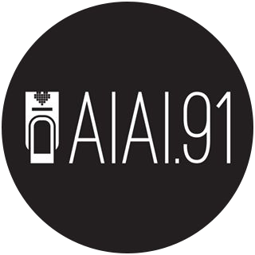

<p align="center">
  <a href="https://www.aiai91nails.com">
    
  </a>
</p>
<h1 align="center">
  AiAi.91 Nail Artist
</h1>

A personalized web application for an inspiring nail artist. It is set up to easily manage appointments, promote nail arts, post blogs, and distribute nail supply. This website was built using a modern JAM Stack web development architecture.

[🔗Demo](https://www.aiai91nails.com)

## 💎 Features

- Customizable content via Netlify CMS
- Emmbedded Square Appointment Management
- Added Ecommerce capabilities using Shopify Storefront API
- Blazing fast site load using Gatsby Static Site Generator
- Modern Material Design with Material UI

## 🚀 Quick start

1.  **Create a Gatsby site.**

    Use the Gatsby CLI to create a new site, specifying the default starter.

    ```sh
    # create a new Gatsby site using the default starter
    gatsby new nail-artist https://github.com/mearatjames/nail-artist
    ```

1.  **Start developing.**

    Navigate into your new site’s directory and start it up.

    ```sh
    cd nail-artist/
    gatsby develop
    ```

1.  **Open the source code and start editing!**

    Your site is now running at `http://localhost:8000`!

    _Note: You'll also see a second link: _`http://localhost:8000/___graphql`_. This is a tool you can use to experiment with querying your data. Learn more about using this tool in the [Gatsby tutorial](https://www.gatsbyjs.org/tutorial/part-five/#introducing-graphiql)._

    Open the `nail-artist` directory in your code editor of choice and edit `src/pages/`. Save your changes and the browser will update in real time!

1.  **Setting up the CMS**
For details on how to configure the CMS, take a look at the [Netlify CMS Docs](https://www.netlifycms.org/docs/intro).

